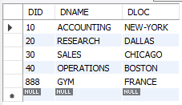
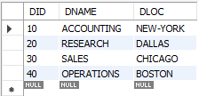
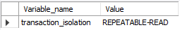
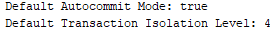

# Lab5: Transactions in SQL
---
## Objective
For this lab, we will use our local MySQL server and MySQL Workbench as the client.

---

## 1. Commit and rollback

**Disable Autocommit:**

Before starting, ensure that autocommit is disabled on our database connection. Autocommit automatically commits each SQL statement as a separate transaction. We want to control the transactions manually, so disable autocommit.

**`rollback`**

```SQL
START TRANSACTION;
INSERT INTO DEPT VALUES(888,'GYM','FRANCE');
SELECT * FROM DEPT;
ROLLBACK;
SELECT * FROM DEPT;
```
Before rollback 



After rollback



**`commit`**

```SQL
START TRANSACTION;
INSERT INTO DEPT VALUES(888,'GYM','FRANCE');
SELECT * FROM DEPT;
COMMIT;
SELECT * FROM DEPT;
```

Before commit


After commit


**What do we observe ?**

Once a transaction is started, any changes made to the database (e.g., INSERT, UPDATE, DELETE statements) are not visible to other users until the transaction is either committed or rolled back. This isolation ensures that the database remains in a consistent state.

---

## 2. Client Failure

```SQL
START TRANSACTION;
INSERT INTO DEPT VALUES(888,'GYM','FRANCE');
SELECT * FROM DEPT;
```
after closing the connection tab and restart SQL workbench :

```SQL
SELECT * FROM DEPT;
```


the department is not inserted in the DEPT table.

---

## 3. TransactionIsolation

The default transaction isolation level of your database by executing the following command:
```SQL
show variables like '%isolation%'
```


The defaut isolation level for InnoDB is '**REPEATABLE READ**'. 

**Experiment 1 - Insert a New Department:**

```SQL
--Start a new transaction.
START TRANSACTION;
--Insert a new department into the DEPT table.
INSERT INTO DEPT VALUES(888,'GYM','FRANCE');
```
1) Within the same transaction, issue a SELECT statement to confirm that the new department is visible to the current transaction.
```SQL
SELECT * FROM DEPT;
```
2) do not commit the transaction.

3) Open a new session/connection or a separate SQL window, and issue a SELECT statement to verify if the new department is visible in this new session. 

We observe that the new department is not visible in the second session because it has not been committed in the first session.

**Experiment 2 - Delete the Department**

We do same step as experiment 1, but instead using '**INSERT**', we use '**DELETE**'. And We got
the same result.

So this experiment demonstrates that, by default, in a "**REPEATABLE READ**" isolation level only sees data committed before the transaction began; it never sees either uncommitted data or changes committed by concurrent transactions during the transaction's execution.

---

## 4. Isolation levels

In this experiment, you will set the transaction isolation level to "**READ UNCOMMITTED**" and observe the effects on two transactions, specifically, the ability of one transaction to see uncommitted changes made by another. "**READ UNCOMMITTED**" is the lowest isolation level, allowing transactions to see uncommitted changes made by other transactions. Here's how we can perform the experiment:

**Experiment with READ UNCOMMITTED Isolation Level:**

1) Start a new transaction and set the isolation level to "READ UNCOMMITTED."

```SQL
SET TRANSACTION ISOLATION LEVEL READ UNCOMMITTED;
START TRANSACTION;
```

2) In the first transaction, insert a new department into the DEPT table.

```SQL
INSERT INTO DEPT VALUE(888,'GYM','FRANCE');
```

3) Within the same transaction, issue a SELECT statement to confirm that the new department is visible to the current transaction.

```SQL
SELECT * FROM DEPT;
```
4) Do not commit the transaction.

5) Open a new session/connection or a separate SQL window, and start a second transaction with the same "**READ UNCOMMITTED**" isolation level.

```SQL
SET TRANSACTION ISOLATION LEVEL READ UNCOMMITTED;
START TRANSACTION;
```

7) In the second transaction, issue a **SELECT** statement to verify if the new department is visible. In a "**READ UNCOMMITTED**" isolation level, We observe that the new department is visible even though it has not been committed in the first transaction.

8) Conclude the first transaction by issuing a **COMMIT**.

```SQL
COMMIT
```

9) In the second transaction, issue a **SELECT** statement again to check if the new department is still visible. It still visible because of the "**READ UNCOMMITTED**" isolation level.

**CONCLUSION**

In this experiment, when we set the transaction isolation level to "**READ UNCOMMITTED**", both transactions can see uncommitted changes made by the other. This behavior is different from the previous exercise, where "**READ COMMITTED**" isolation level prevented the second transaction from seeing uncommitted changes.

"**READ UNCOMMITTED**" allows for lower data integrity but provides greater concurrency, as it permits multiple transactions to see uncommitted data changes. However, it should be used with caution, as it can lead to issues like dirty reads and non-repeatable reads. The choice of isolation level should be based on the specific requirements and constraints of your application to balance data consistency and performance.

---

## 5. Isolation levels – Continued

When you set the transaction isolation level to "**SERIALIZABLE**", it's the highest isolation level, which ensures strict data integrity and consistency. Transactions executed under the "**SERIALIZABLE**" isolation level are not allowed to see uncommitted changes made by other transactions. This level provides the highest degree of isolation but can lead to reduced concurrency, as transactions may need to wait for each other to complete. 

Here's what you we observe in the second transaction:

1) Start a new transaction and set the isolation level to "SERIALIZABLE."

```SQL
SET TRANSACTION ISOLATION LEVEL READ UNCOMMITTED;
START TRANSACTION;
```
2) In the first transaction, insert a new department into the DEPT table.

```SQL
INSERT INTO DEPT VALUE(888,'GYM','FRANCE');
```

3) Within the same transaction, issue a SELECT statement to confirm that the new department is visible to the current transaction.
```SQL
SELECT * FROM DEPT;
```
4) Do not commit the transaction.
5) Open a new session/connection or a separate SQL window, and start a second transaction with the same "SERIALIZABLE" isolation level.
```SQL
SET TRANSACTION ISOLATION LEVEL READ UNCOMMITTED;
START TRANSACTION;
```
6) In the second transaction, issue a SELECT statement to verify if the new department is visible. In a "SERIALIZABLE" isolation level, we observe that the new department is not visible in the second transaction until the first transaction is committed.

7) Conclude the first transaction by issuing a COMMIT.
```SQL
COMMIT;
```
8) In the second transaction, issue a SELECT statement again to check if the new department is now visible. we observe that the new department is visible after the first transaction is committed.

**Observation and Explanation:**

In the "**SERIALIZABLE**" isolation level, the second transaction cannot see uncommitted changes made by the first transaction. This is because "**SERIALIZABLE**" ensures that each transaction behaves as if it has exclusive access to the data, and it provides the highest level of isolation and consistency. As a result, the second transaction has to wait until the first transaction is committed before it can see the changes made by the first transaction.

"**SERIALIZABLE**" is the most restrictive isolation level, and it guarantees strong data integrity and consistency. However, it can lead to increased contention and potential performance bottlenecks, as transactions may need to be serialized to maintain these guarantees. The choice of isolation level should be made based on the specific requirements and trade-offs of our application.

---

## 6. JDBC code

to display the default value of the autocommit mode :

```Java
public DataAccess(String url, String login, String password) throws SQLException {
    connection = DriverManager.getConnection(url, login, password);
    System.out.println("connected to " + url);
    // Display the default autocommit mode
    System.out.println("Default Autocommit Mode: " + connection.getAutoCommit());
}
```

to display the default level of transaction isolation :

```Java
public DataAccess(String url, String login, String password) throws SQLException {
    connection = DriverManager.getConnection(url, login, password);
    System.out.println("connected to " + url);
    // Display the isolation level
    int defaultIsolationLevel = connection.getTransactionIsolation();
    System.out.println("Default Transaction Isolation Level: " + defaultIsolationLevel);
}
```

Output :



**Commit and rollback :**

**`"raiseSalary" method :`**

```Java
// Method to raise the salary of employees with a specified job
public boolean raiseSalary(String job, float amount) throws SQLException {
    try {
        connection.setAutoCommit(false); // Start a new transaction

        // SQL query without a prepared statement (be cautious of SQL injection here)
        String sql = "UPDATE EMP SET SAL = SAL + " + amount + " WHERE JOB = '" + job + "'";

        try (Statement statement = connection.createStatement()) {
            // Execute the SQL update
            int rowsAffected = statement.executeUpdate(sql);

            connection.commit(); // Commit the transaction if successful
            return rowsAffected > 0;
        } catch (SQLException e) {
            connection.rollback(); // Roll back the transaction on SQL exception
            throw e; // Rethrow the exception for higher-level handling
        }
    } catch (SQLException e) {
        // Handle the exception or rethrow it if necessary
        e.printStackTrace();
        return false;
    } finally {
        connection.setAutoCommit(true); // Reset autocommit to its default state
    }
}
```

**`"raiseSalary" method with prepared statement :`**

```Java
// Method to raise the salary of employees with a specified job using a prepared statement
public boolean raiseSalaryPS(String job, float amount) throws SQLException {
    try {
        connection.setAutoCommit(false); // Start a new transaction

        // SQL query with a prepared statement to update salary
        String sql = "UPDATE EMP SET SAL = SAL + ? WHERE JOB = ?";

        try (PreparedStatement statement = connection.prepareStatement(sql)) {
            // Set parameters for the prepared statement
            statement.setFloat(1, amount);
            statement.setString(2, job);

            // Execute the SQL update
            int rowsAffected = statement.executeUpdate();

            connection.commit(); // Commit the transaction if successful
            return rowsAffected > 0;
        } catch (SQLException e) {
            connection.rollback(); // Roll back the transaction on SQL exception
            throw e; // Rethrow the exception for higher-level handling
        }
    } catch (SQLException e) {
        // Handle the exception or rethrow it if necessary
        e.printStackTrace();
    } finally {
        connection.setAutoCommit(true); // Reset autocommit to its default state
    }
    return false;
}
```
We can modify other methods by following the same similarities.

In these modified methods, we ensure that each method operates within a transaction and handles exceptions gracefully, rolling back the transaction if an SQLException is thrown. The finally block resets the autocommit mode to its default state.