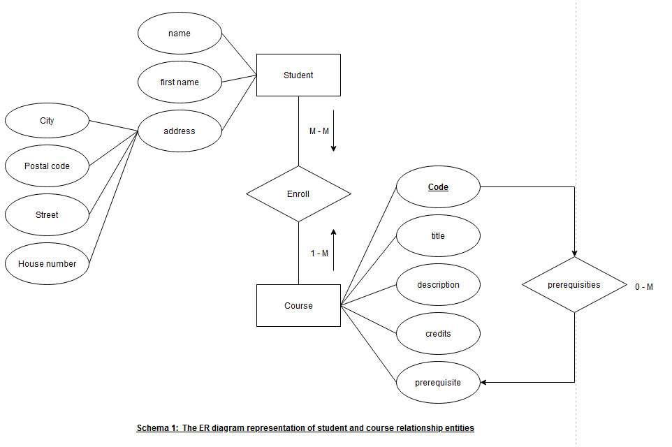
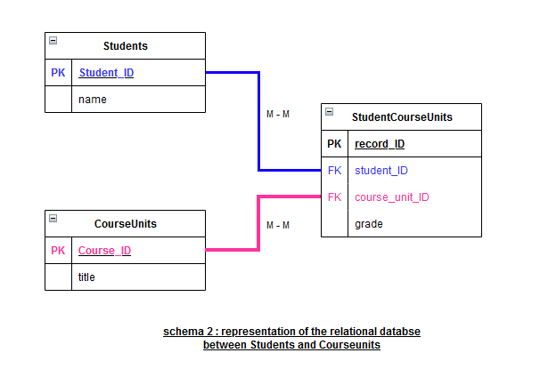
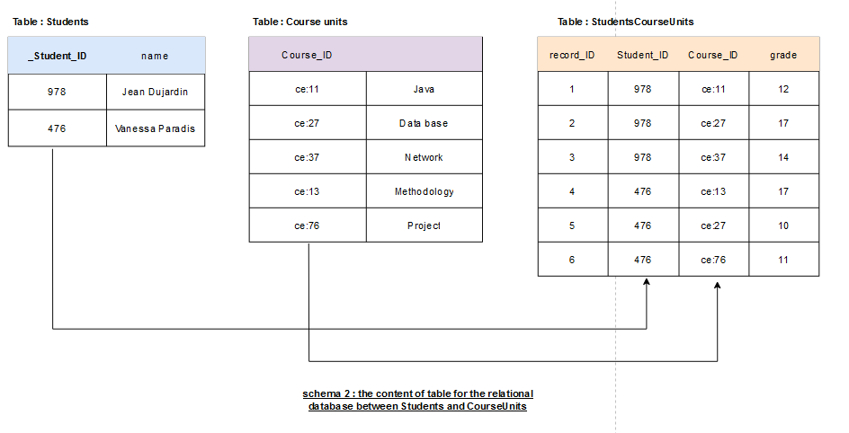

# Lab 6
---
## Document oriented modeling with JSON

We want to create a document-oriented database to manage courses and students, given the following information: 

➢ A course is described by the attributes code, title, description, credits and prerequisite. 

➢ The prerequisites are other courses. 

➢ A student is described by the attributes name, first name, address. 

➢ Addresses are made up of a house number, street, city and postal code. 

➢ A student takes several courses and the courses are taken by several students. 

### 1. Make the entity relationship diagram (ERD) in UML. 



**In this diagram**:

**Course** and **Student** are the main entities.

**Course** has attributes: **code**, **title**, **description**, **credits**, and **a relationship to Prerequisite**.

**Student** has attributes: **student_id**, **first_name**, **last_name**, and **a relationship to Address**.

**Address** has attributes: **house_number**, **street**, **city**, **postal_code**.

**Prerequisites** is a relationship between **Course** and **other Course entities**.

**In this representation**:

The "**Course**" class has attributes related to course details, a **zero-to-many relationship** with prerequisites, and a **one-to-many relationship** and  with students.

The "**Student**" class has attributes related to student details, a **one-to-one relationship** with the "**Address**" class to represent the student's address, and a **many-to-many relationship** with courses.

### 2. Suggest a JSON example equivalent to what we would have done in relational model. 

**`Course JSON exemple`**
```Json
{
  "code": "api04",
  "title": "DW et NOSQL",
  "description": "Data Warehousing and NoSQL Databases",
  "credits": 3,
  "prerequisite": ["intro_db", "data_structures"]
}

```
**`Student JSON exemple`**

```Json
{
  "name": "Smith",
  "first_name": "John",
  "address": {
    "house_number": "123",
    "street": "Main St",
    "city": "Exampleville",
    "postal_code": "12345"
  },
  "courses_taken": ["api04", "web_dev", "data_mining"]
}

```
### 3. Provide a JSON example based on embedded data modeling. 

In an embedded data modeling approach, data is stored within a single document, where related information is nested or embedded within the parent document. This approach is commonly used in document-oriented databases like MongoDB. 

Here's a JSON example based on embedded data modeling for courses and students:

```Json
{
  "course": {
    "code": "api04",
    "title": "DW et NOSQL",
    "description": "Data Warehousing and NoSQL Databases",
    "credits": 3,
    "prerequisite": [
      {
        "code": "intro_db",
        "title": "Introduction to Databases"
      },
      {
        "code": "data_structures",
        "title": "Data Structures"
      }
    ]
  },
  "student": {
    "name": "Smith",
    "first_name": "John",
    "address": {
      "house_number": "123",
      "street": "Main St",
      "city": "Exampleville",
      "postal_code": "12345"
    },
    "courses_taken": [
      {
        "code": "api04",
        "title": "DW et NOSQL"
      },
      {
        "code": "web_dev",
        "title": "Web Development"
      },
      {
        "code": "data_mining",
        "title": "Data Mining"
      }
    ]
  }
}

```

**What is the main feature of this solution?** 

The main feature of embedded data modeling is that it allows us to store related information in a single document. 

In the JSON example provided, course prerequisites and courses taken by a student are embedded in the parent document. This reduces the need for complex joins or separate collections/tables, making it easier to retrieve all related data in a single query.
 
It also improves reading performance, as a single document search can provide all the information required.

**Is it always possible to have a solution based only on embedded?**

Embedded data modeling is appropriate when the relationships between entities are relatively simple and not very interconnected. 

It works well when we don't need to perform complex queries or transactions involving multiple documents. 

However, it is not necessarily suitable for all scenarios.


### 4. Provide a JSON example based on the references.  

In a reference-based data model, data is stored in separate documents (or tables in a relational system) and references (or foreign keys in a relational system) are used to establish relationships between these documents. This approach allows for more complex, interconnected data structures.

 **`course collection`**

 ```json
 {
  "code": "api04",
  "title": "DW et NOSQL",
  "description": "Data Warehousing and NoSQL Databases",
  "credits": 3,
  "prerequisite": ["intro_db", "data_structures"]
}
```

**`student collection`**

```Json
{
  "student_id": "12345",
  "name": "Smith",
  "first_name": "John",
  "address": {
    "house_number": "123",
    "street": "Main St",
    "city": "Exampleville",
    "postal_code": "12345"
  },
  "courses_taken": ["api04", "web_dev", "data_mining"]
}
```

**What are the main differences with a relational system?** 

**Data Structure**:

In a relational system, data is generally structured in tables with rows and columns, and relationships are established using foreign keys.
In the reference-based JSON example, data is structured in separate documents or collections, and references (course codes in the course_taken field of the student document) are used to represent relationships.

**Flexibility**:

JSON documents based on references are more flexible in terms of schema. We can add or remove fields as needed without requiring schema changes across the entire dataset.
Relational systems have a fixed schema, and modifying the schema often involves altering the structure of tables, which can be more rigid.

**Read Performance**:

In a relational system, reading data from several tables often involves complex JOIN operations that can affect query performance.
With references in JSON documents, we can retrieve related data more efficiently because each document contains the necessary references, reducing the need for JOINs. However, we may still need to perform additional queries to retrieve the referenced data.

## 5. Knowing that the objective of the application is to visualize a list of students with the courses enrolled in, and access to course details only when you click on its code or title. 

**Propose a solution adapted to this data base by using both reference and embedded.** 

To achieve the objective of visualizing a list of students with the courses in which they are enrolled, and accessing course details only when you click on the course code or title, we can use a hybrid solution that combines both reference data modeling and integrated data modeling.

Here's a proposed data structure for this scenario:

**`Embedded Data for Student Information`**

```Json
{
  "name": "Smith",
  "first_name": "John",
  "address": {
    "house_number": "123",
    "street": "Main St",
    "city": "Exampleville",
    "postal_code": "12345"
  },
  "courses_taken": [
    {
      "code": "api04",
      "title": "DW et NOSQL",
    },
    {
      "code": "api05",
      "title": "Web Development",
    },
    {
      "code": "api06",
      "title": "Data Mining",
    }
  ]
}
```

**`Courses Collection with References for Course Details`**

```Json
{
  "code": "api04",
  "title": "DW et NOSQL",
  "description": "Data Warehousing and NoSQL Databases",
  "credits": 3,
  "prerequisite": ["intro_db", "data_structures"]
}

{
  "code": "api05",
  "title": "Web Development",
  "description": "Introduction to Web Development",
  "credits": 4,
  "prerequisite": ["html_css", "js_fundamentals"]
}

{
  "code": "api06",
  "title": "Data Mining",
  "description": "Fundamentals of Data Mining Techniques",
  "credits": 3,
  "prerequisite": ["intro_stats", "machine_learning"]
}

```

**Explanation:**

Student information is integrated into the student document. Each course taken by the student is represented as an embedded object, which includes the course code and title. This allows us to view a student's courses without having to access the course collection separately.

The course collection contains separate documents for each course, including course details such as description, credits and prerequisites. However, prerequisites are represented as references to other courses by their codes.

---

## SQL VS NoSQL 

You run an e-commerce site and expect a million users (or more).

**1. which database do you prefer to use: relational or NoSQL?**

The choice between a relational database and a NoSQL database for our e-commerce site, which is expected to have a million users or more, depends on a number of factors. Both types of database have their strengths and weaknesses, and the decision needs to be based on your specific requirements.

#### Relational Database:

**Structured Data**: If our e-commerce site deals with well-structured data and complex relationships (e.g., users, products, orders, payments), consider using a relational database like MySQL, PostgreSQL, or SQL Server for strong data consistency and integrity, as well as complex query support.

**ACID Transactions**: For applications requiring strong consistency and ACID transaction support, relational databases are a strong choice.

**Complex Queries**: When complex queries, aggregations, and reporting are crucial, relational databases are well-suited.

#### NoSQL Database:

**Unstructured or Semi-Structured Data**: If our e-commerce site deals with unstructured or semi-structured data, NoSQL databases like MongoDB, Cassandra, or DynamoDB provide flexibility to adapt to changing data requirements.

**Horizontal Scalability**: NoSQL databases excel in horizontal scalability, making them a significant advantage for handling a large number of users by adding more servers.

**Schema Flexibility**: NoSQL databases offer flexibility for evolving data models, beneficial in dynamic e-commerce environments.

**Speed and Performance**: NoSQL databases can offer exceptional read and write speed in specific use cases, crucial for ensuring a responsive user experience

In practice, many large-scale applications use a combination of these two types of database, sometimes referred to as a polyglot persistence approach. We can use a relational database for certain core functions, such as managing user accounts and financial transactions, while employing NoSQL databases for product catalogue management, user-generated content or analytics.

#### Propose a representation of this information in document form

**`Prioritizing User Access`**

```Json
{
  "users": [
    {
      "id": 1,
      "email": "s@cnam.fr",
      "nom": "Serge",
      "visits": [
        {
          "page": "http://cnam.fr/A",
          "nbVisits": 2
        },
        {
          "page": "http://cnam.fr/C",
          "nbVisits": 1
        }
      ]
    },
    {
      "id": 2,
      "email": "b@cnam.fr",
      "nom": "Benoît",
      "visits": [
        {
          "page": "http://cnam.fr/B",
          "nbVisits": 1
        }
      ]
    }
  ]
}

```

**`Prioritizing Access Through Pages Visited`**

```Json
{
  "pages": [
    {
      "page": "http://cnam.fr/A",
      "visits": [
        {
          "id": 1,
          "email": "s@cnam.fr",
          "nom": "Serge",
          "nbVisits": 2
        }
      ]
    },
    {
      "page": "http://cnam.fr/B",
      "visits": [
        {
          "id": 2,
          "email": "b@cnam.fr",
          "nom": "Benoit",
          "nbVisits": 1
        }
      ]
    },
    {
      "page": "http://cnam.fr/C",
      "visits": [
        {
          "id": 1,
          "email": "s@cnam.fr",
          "nom": "Serge",
          "nbVisits": 1
        }
      ]
    }
  ]
}

```

#### Cnam's IT department has decided to represent its data under form of structured documents to facilitate analytical processes. Here is an example of student-centered documents including Course Units (CU) followed by each student.

```Json
{  
    "_id": 978,  
    "name": "Jean Dujardin",  
    "CU": [ 
        { 
            "id": "ce:11", 
            "title": "Java", 
            "grade": 12 
        },  
        {   
            "id": "ce:27", 
            "title": "data base", 
            "grade": 17
        },  
        { 
            "id": "ce:37", 
            "title": "Network", 
            "grade": 14
        }  
    ]  
}  
{  
    "_id": 476,  
    "name": "Vanessa Paradis",  
    "CE": [
        {
            "id": "ce:13", 
            "title": "Methodology", 
            "grade": 17, 
        }, 
        {
            "id": "ce:27", 
            "title": "Data base", 
            "grade": 10
        },  
        {
            "id": "ce:76", 
            "title": "Project", 
            "grade": 11
        }  
    ]  
} 
```
#### Knowing that these documents are produced from a relational data base, create the schema of relational database and indicate the content of the tables. 

On the basis of the documents provided by the students, we can deduce the schema of a relational database and create tables to represent this structured data. 

There appear to be two main entities: 'students' and 'course units' (CUs). 

Students can have several course units with associated attributes such as ID, title and grade.

Here's a schema for the relational database and the content of the tables

**`Table: Students`**

**Columns**:

**student_ID (Primary Key)**: Unique identifier for each student.

**name**: Name of the student.

**`Table: CourseUnits`**

**Column**s:

**course_ID (Primary Key)**: Unique identifier for each Course Unit.

**title**: Title of the Course Unit.

**`Table: StudentCourseUnits (Many-to-Many Relationship Table)`**

**Columns**:

**record_ID (Primary Key)**: Unique identifier for each relationship record.

**student_ID (Foreign Key)**: References the "_id" column in the "Students" table.

**course_unit_ID (Foreign Key)**: References the "id" column in the "CourseUnits" table.

**grade**: The grade associated with a specific student's performance in a Course Unit.





The "StudentCourseUnits" table represents the many-to-many relationship between students and course units. 

It allows us to associate students with their respective course units and to store additional attributes such as the grades achieved by each student in a specific course unit. This schema and table structure allows you to efficiently store and query data about students and their course units within a relational database.